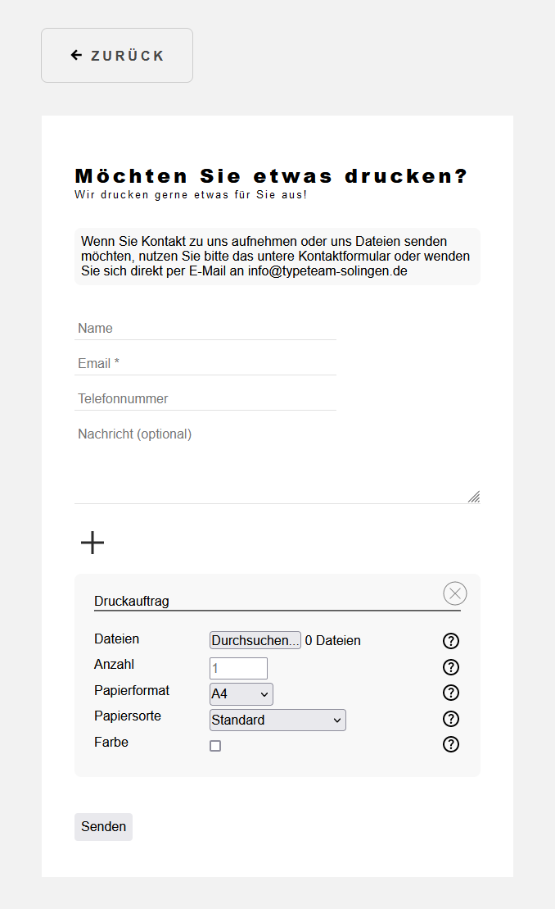
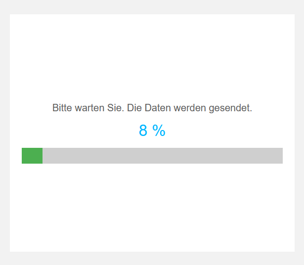
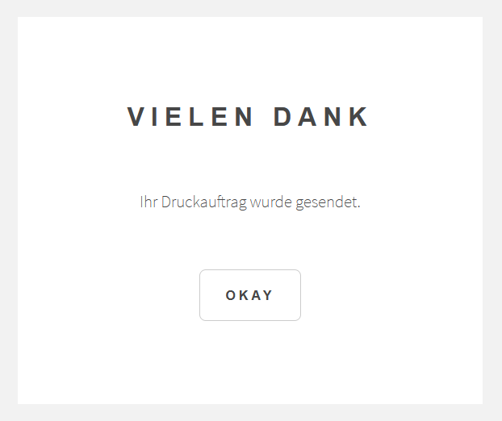
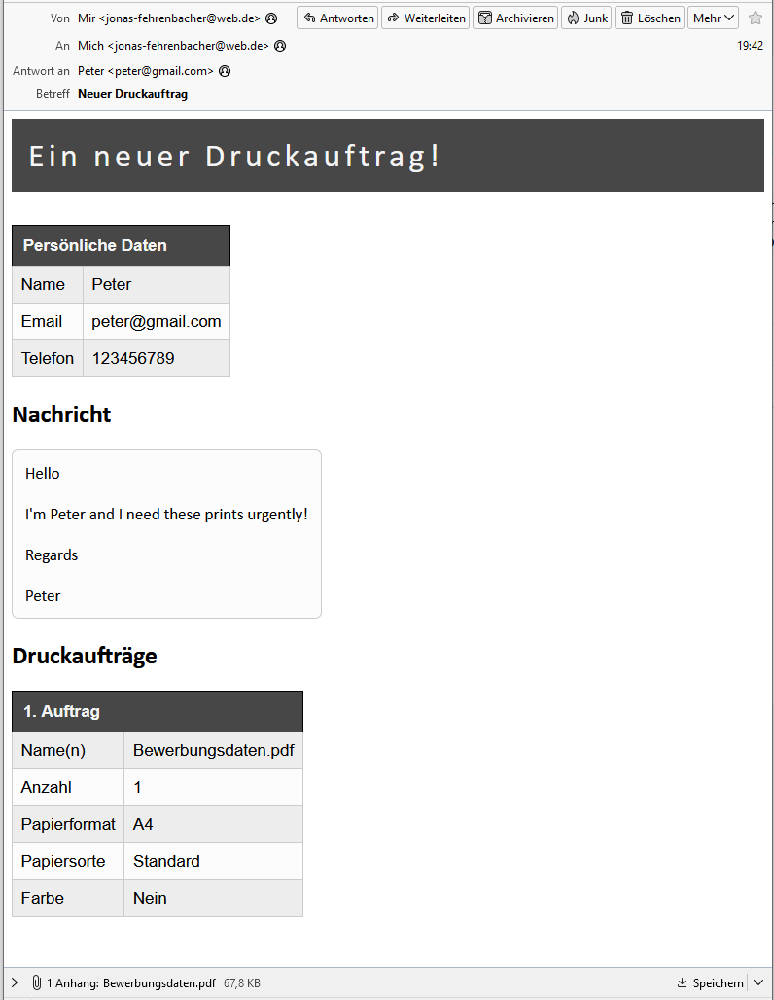
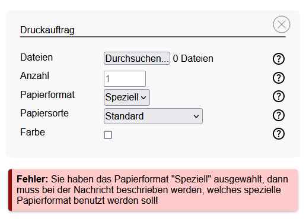

# PrinterForm
This is a finished product and can be injected into every website: Have a \<a>-Tag which links to this sites index.html and change this sites back button link (see config.json).
This project sends print jobs to the email address specified in "server/assets/.env.json" via PHPMailer. In "assets/I18n.json" all used texts can be modified and new languages can be added.
In "assets/config.json" configurations like max attachment memory size, language, back button URL and such can be specified. Cloudflare turnstile is used to verify users, therefore a site key 
(see config.json) and a secret key (see .env.json) is used. ".env.json" holds sensitive data, so it's protected by the "server/assets/.htaccess" file. Emails use HTML and CSS, but most Email
providers support only inline CSS, so "assets/emailCSS.json" is used to specify the emails CSS.

## Printer Form

 

## Email loading state

 

## Email confirmation state

 

## Email

 

## Error handling

 

# What is done next?
- Nothing really - everything is finished and fine.